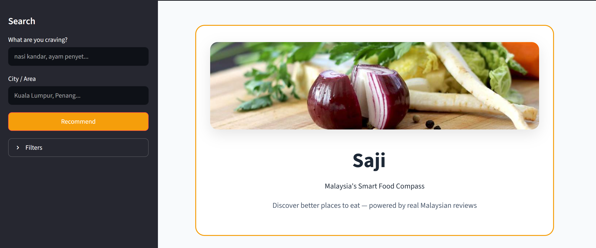
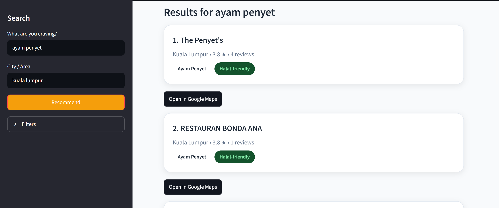

# Saji 🍽️
**Malaysia's Smart Food Compass**

A Streamlit web app that helps you discover great Malaysian restaurants based on real reviews, smart recommendations, and useful filters (Halal, cuisine type, rating, etc.).

---

## Features

- **Smart Search**: Type what you're craving (e.g. "nasi kandar", "ayam penyet")
- **Location Filter**: Search by city or area
- **Halal & Dietary Filters**: Halal-friendly, exclude pork & alcohol
- **Cuisine Types**: Malay, Mamak, Chinese, Indian, Japanese, Western, etc.
- **Popular Searches**: Quick buttons with beautiful food images
- **Google Maps Integration**: One-click direction to restaurants
- **Review-Based Ranking**: Uses Bayesian scoring from real Malaysian reviews

---

## How to Run Locally

### 1. Clone the repository
```bash
git clone https://github.com/ziyadkamaruzaman/saji.git
cd saji
```
### 2. Create virtual environment
```bash
python -m venv venv
venv\Scripts\activate    # Windows
# source venv/bin/activate  # Mac/Linux
```
### 3. Install dependencies
```bash
pip install -r requirements.txt
```
### 4. Run the app
```bash
streamlit run app.py
```

## Project Structure
```bash
saji/
├── app.py                    # Main Streamlit app
├── requirements.txt
├── assets/                   # Food images & logo
├── data/raw/                 # Raw data (not tracked on GitHub)
├── artifacts/                # Model artifacts (not tracked)
├── src/saji/                 # Core recommendation engine
│   ├── recommender.py
│   ├── halal.py
│   └── ...
└── README.md
```

## Tech Stack

- **Frontend**: Streamlit  
- **Backend**: Python, scikit-learn (TF-IDF + cosine similarity)  
- **Data Processing**: Pandas (real Malaysian restaurant reviews)  
- **Deployment**: Streamlit Community Cloud, Hugging Face Spaces, Railway


## Screenshots
###  Home Page


###  Search Feature


## License

This project is developed for educational and personal portfolio purposes.

## Acknowledgements

Built for Malaysian food lovers 🇲🇾  

Contributions, feedback, and suggestions are always welcome — feel free to open an issue or submit a pull request!